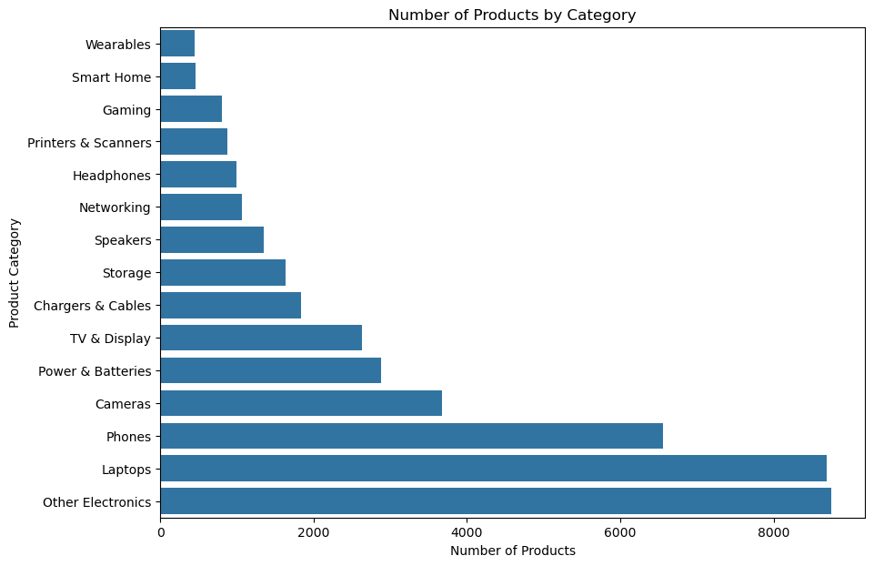

# 🛒 Amazon Product Sales Analysis


An exploratory data analysis of **42,675 Amazon product listings**, uncovering which product and listing characteristics — price, ratings, reviews, Best Seller badges, coupons, and sponsorship — are associated with higher purchase activity.

---

## 📋 Table of Contents

- [Business Questions](#-business-questions)
- [Dataset](#-dataset)
- [Analysis Workflow](#-analysis-workflow)
- [Key Findings](#-key-findings)
  - [Product Categories](#product-categories)
  - [Reviews & Ratings](#reviews--ratings)
  - [Price](#price)
  - [Best Seller Products](#best-seller-products)
  - [Coupons](#coupons)
  - [Sponsored Listings](#sponsored-listings)
  - [High-Demand Products](#high-demand-products)
- [Correlation Overview](#-correlation-overview)
- [Tools Used](#-tools-used)
- [Project Structure](#-project-structure)
- [Getting Started](#-getting-started)

---

## ❓ Business Questions

This analysis was guided by a set of practical, business-relevant questions:

- Which product categories have higher purchase activity?
- Is there a relationship between ratings, reviews, and purchases?
- How do product price and discount levels relate to demand?
- Do Best Seller products show higher purchase activity?
- Is there a difference in purchases between products with and without coupons?
- How do sponsored and organic listings compare?
- What characteristics are common among high-demand products?

---

## 📦 Dataset

The dataset contains **42,675 Amazon product listings**, spanning 15 categories, with details on:

| Field Group | Includes |
|---|---|
| **Product Info** | Title, category, rating |
| **Engagement** | Number of reviews, purchases in the last month |
| **Pricing** | Original price, discounted price, discount % |
| **Listing Signals** | Best Seller status, sponsored status, coupon availability, Buy Box availability |
| **Other** | Delivery information, sustainability tags |

<p align="center">
  
</p>

> Listing volume is dominated by broad categories like **Other Electronics**, **Laptops**, and **Phones** — but as the findings below show, listing volume doesn't necessarily translate into purchase activity.

---

## 🔍 Analysis Workflow

The notebook walks through a complete EDA pipeline:

1. **Data cleaning & quality checks** — missing values, duplicates
2. **Distribution analysis** — ratings, prices, discounts, reviews, purchases
3. **Category-level analysis** — purchase activity by product category
4. **Price & discount analysis** — how pricing relates to demand
5. **Relationship analysis** — reviews, ratings, and purchases
6. **Best Seller comparison** — statistical testing with Mann–Whitney U
7. **Coupon & sponsorship analysis**
8. **High-demand product profiling** (90th percentile of purchases)
9. **Correlation analysis** using log-transformed purchase data

---

## 📊 Key Findings

### Product Categories

**Power & Batteries** led all categories with a median of roughly **1,000 purchases** in the last month, followed by **Wearables** (~800 purchases). Notably, larger categories like **Phones** and **Laptops** had lower median purchase activity despite far higher listing counts.

<p align="center">
  
</p>

### Reviews & Ratings

Products with more reviews consistently showed higher purchase activity. The correlation between log-transformed reviews and log-transformed purchases was **~0.49** — one of the stronger relationships in the dataset.

<p align="center">
  
</p>

Ratings showed a moderate relationship as well (**correlation ≈ 0.27**). High-demand products had a median rating of **4.7**, versus **4.5** for the rest.

<p align="center">
  
</p>

### Price

Lower-priced products drove substantially higher purchase activity. Splitting products into four price segments (by discounted price) shows a clear downward trend:

| Price Segment | Median Purchases |
|---|---:|
| Low Price | 500 |
| Mid-Low Price | 200 |
| Mid-High Price | 100 |
| High Price | 50 |

<p align="center">
  
</p>

### Best Seller Products

Best Seller listings showed **substantially higher** purchase activity than non-Best-Seller listings:

- **Best Seller** — median log-purchases: **8.70**
- **Not Best Seller** — median log-purchases: **5.30**

A Mann–Whitney U test confirmed this difference is statistically significant (**p ≈ 1.12 × 10⁻¹⁰¹**). This is a strong *association* — not proof that the badge itself *causes* higher sales.

<p align="center">
  
</p>

### Coupons

Products with a coupon had a median of **~700 purchases**, compared to **~200 purchases** for products without one — suggesting coupon availability is linked to stronger demand.

### Sponsored Listings

Sponsored listings out-performed organic listings on median purchases:

- **Sponsored** — ~1,000 median purchases
- **Organic** — ~200 median purchases

About **34% of sponsored listings** qualified as high-demand, versus only **~6% of organic listings**. This is likely bidirectional — strong products may get sponsored *because* they already sell well, not purely the other way around.

### High-Demand Products

High-demand products (≥ 90th percentile of monthly purchases) stood apart on nearly every metric:

| Metric | High-Demand | Other Products |
|---|---:|---:|
| Median Rating | **4.7** | 4.5 |
| Median Reviews | **5,045** | 288 |
| Median Discounted Price | **$25.47** | $93.99 |

Best Seller products were also disproportionately represented in this group, and the effect is concentrated in specific categories:

<p align="center">
  
</p>

---

## 🔗 Correlation Overview

A full correlation heatmap across numeric features summarizes the relationships explored above — purchases correlate most strongly with reviews, and negatively with price:

<p align="center">
  
</p>

---

## 🛠 Tools Used

- **Python**
- **Pandas** & **NumPy** — data wrangling
- **Matplotlib** & **Seaborn** — visualization
- **SciPy** — statistical testing (Mann–Whitney U)
- **Jupyter Notebook** — analysis environment

---

## 📁 Project Structure

```text
amazon-product-sales-analysis/
│
├── data/
│   └── amazon_products_sales_data_cleaned.csv
│
├── notebooks/
│   └── Amazon_Product_Sales_Analysis.ipynb
│
├── assets/
│   └── (charts used in this README)
│
├── .gitattributes
├── .gitignore
└── README.md
```

---

## 🚀 Getting Started

```bash
# Clone the repository
git clone <your-repo-url>
cd amazon-product-sales-analysis

# Install dependencies
pip install pandas numpy matplotlib seaborn scipy jupyter

# Launch the notebook
jupyter notebook notebooks/Amazon_Product_Sales_Analysis.ipynb
```

---

<p align="center"><i>All figures above are generated directly from the analysis notebook.</i></p>
